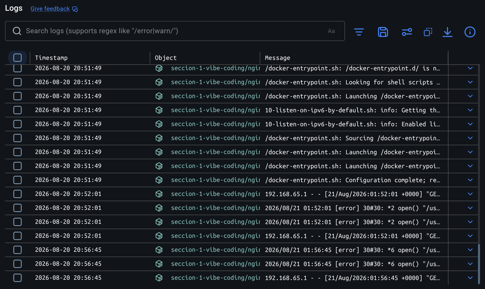
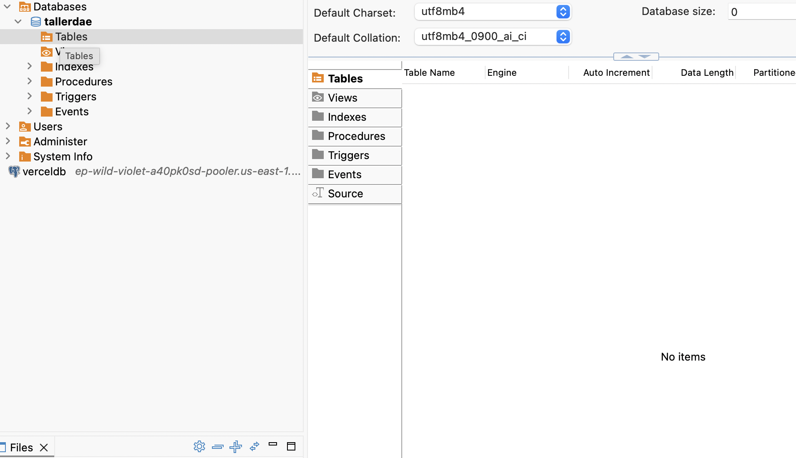

# Bitácora de sesión — Vibe Coding con Kiro

**Proyecto:** Ambiente local de desarrollo con Docker Compose  
**Sección:** 1 — Vibe Coding  
**Fecha:** 20 de agosto de 2026

---

## Registro cronológico

| # | Solicitud del usuario | Acción de Kiro | Ajuste / Motivo |
|---|---|---|---|
| 1 | Crear un ambiente local con Docker Compose que incluya MySQL 8, Nginx y persistencia de datos, levantable con un solo comando | Se planificó la tarea en 5 pasos usando una lista de tareas estructurada | Se eligió organizar el trabajo paso a paso para tener trazabilidad y control sobre cada entregable |
| 2 | Estructura de carpetas dentro de `seccion-1-vibe-coding` | Se creó la carpeta base con subcarpeta `nginx/html/` | La subcarpeta era necesaria para separar la configuración del servidor de los archivos estáticos servidos |
| 3 | Archivo `.env` con credenciales de MySQL y puerto de Nginx | Se creó `.env` con variables reales y `.env.example` como plantilla sin valores sensibles | Se agregó `.env.example` por buena práctica: permite que otros desarrolladores sepan qué variables existen sin exponer credenciales reales |
| 4 | Configuración de Nginx para servir una página estática y soportar proxy hacia backend en el futuro | Se creó `nginx.conf` con bloque `server` en puerto 80 y el bloque `location /api/` comentado | El bloque de proxy se dejó comentado porque el backend aún no existe; así está listo para activarse sin reescribir la config |
| 5 | Página de bienvenida HTML para Nginx | Se creó `index.html` con diseño moderno mostrando el estado de los servicios (MySQL, Nginx, Backend pendiente) | Se optó por un diseño visual útil en lugar de una página en blanco, para que sea evidente que el ambiente levantó correctamente |
| 6 | Archivo `docker-compose.yml` principal | Se definieron los servicios `mysql` (con healthcheck) y `nginx` (con `depends_on: condition: service_healthy`), volumen nombrado y red bridge interna | El healthcheck garantiza que Nginx solo arranque cuando MySQL ya acepte conexiones, evitando errores de inicio en cadena |
| 7 | Levantar el ambiente con `docker compose up -d` | Se detectó que Docker Desktop no estaba corriendo; se abrió automáticamente con `open /Applications/Docker.app` y se esperó a que el daemon estuviera listo | El socket de Docker no existía en la ruta esperada; en lugar de fallar, se resolvió la causa raíz iniciando el daemon antes de reintentar |
| 8 | Error en DBeaver: *Public Key Retrieval is not allowed* | Se explicó que MySQL 8 usa `caching_sha2_password` por defecto, incompatible con clientes JDBC sin configuración adicional. Se dieron dos soluciones: habilitar `allowPublicKeyRetrieval=true` en Driver properties, o agregarlo directamente a la URL JDBC | No se modificó el `docker-compose.yml` porque el ajuste en el cliente es suficiente y menos invasivo; se ofreció la alternativa de cambiar el plugin de autenticación si el usuario lo prefería |
| 9 | README técnico en `seccion-1-vibe-coding/` con instrucciones de levantamiento y detalle de DBeaver | Se creó `README.md` con secciones de requisitos, estructura, configuración, comandos, conexión MySQL, solución al error de DBeaver y guía para agregar backend | Se consolidó toda la información en un solo documento de referencia para que cualquier desarrollador pueda replicar el ambiente sin asistencia adicional |
| 10 | Bitácora de la conversación en `Entregables/README.md` | Se creó la carpeta `Entregables/` y este archivo con el registro completo de la sesión | La bitácora documenta decisiones y ajustes, no solo comandos ejecutados, para que sirva como evidencia del proceso de Vibe Coding |

---

## Archivos generados en esta sesión

```
seccion-1-vibe-coding/
├── .env
├── .env.example
├── .gitignore
├── docker-compose.yml
├── README.md
├── Entregables/
│   └── README.md          ← este archivo
└── nginx/
    ├── nginx.conf
    └── html/
        └── index.html
```


## Bitácora

Registro cronológico de la sesión de Vibe Coding: qué se solicitó, qué decisiones tomó Kiro y por qué se realizaron los ajustes.

[Ver Bitácora](Bitacora/README.md)

---

## Capturas

### Docker — contenedores corriendo



### DBeaver — conexión exitosa a MySQL



---

## Preguntas

Respuestas a las preguntas del taller sobre el proceso de Vibe Coding y Spec-Driven Development.

[Ver Preguntas](Preguntas/README.md)