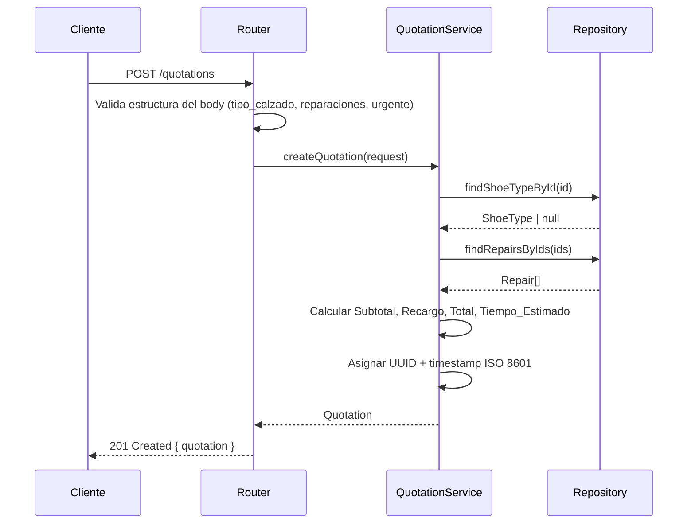

# Design Document — shoe-repair-quotation

## Overview

Este documento describe el diseño técnico del **backend de cotizaciones de reparación de calzado**. El sistema es una API REST que expone tres operaciones principales:

1. Consultar el catálogo de tipos de calzado disponibles.
2. Consultar el catálogo de reparaciones disponibles.
3. Generar una cotización estimada (costo y tiempo de entrega) a partir de un tipo de calzado y una o más reparaciones.

El repositorio de datos opera completamente en memoria; no hay base de datos externa. No se contempla autenticación ni pagos.

**Stack tecnológico:**
- Lenguaje: **TypeScript** (tipado estático, seguridad en tiempo de compilación)
- Runtime: **Node.js 20 LTS**
- Framework HTTP: **Express 4**
- Testing: **Vitest** + **fast-check** (property-based testing)
- Identificadores únicos: **crypto.randomUUID()** (nativo de Node.js)

La elección de Express es deliberada: es minimalista, bien conocido y evita dependencias innecesarias para un backend sin persistencia. Fast-check es la librería de property-based testing más madura del ecosistema TypeScript/JavaScript.

---

## Architecture

El sistema sigue una arquitectura en capas (Layered Architecture) con tres capas bien definidas:

```
┌─────────────────────────────────────────┐
│              HTTP Layer                 │
│  Express Router + Request Validation    │
└───────────────┬─────────────────────────┘
                │  DTOs / parsed inputs
┌───────────────▼─────────────────────────┐
│            Service Layer                │
│  QuotationService  │  CatalogService    │
└───────────────┬─────────────────────────┘
                │  Domain objects
┌───────────────▼─────────────────────────┐
│          Repository Layer               │
│  InMemoryShoeTypeRepository             │
│  InMemoryRepairRepository               │
└─────────────────────────────────────────┘
```

**Responsabilidades por capa:**

| Capa | Responsabilidad |
|---|---|
| HTTP | Parsear y validar la petición HTTP, mapear errores de dominio a códigos HTTP |
| Service | Contener toda la lógica de negocio (cálculos de cotización, validaciones de dominio) |
| Repository | Almacenar y recuperar los catálogos en memoria; sembrar datos iniciales |

**Flujo de una solicitud de cotización:**



---

## Components and Interfaces

### 1. Routers (HTTP Layer)

**`CatalogRouter`** — monta en `/catalog`

| Método | Ruta | Descripción |
|---|---|---|
| GET | `/catalog/shoe-types` | Devuelve todos los `ShoeType` |
| GET | `/catalog/repairs` | Devuelve todas las `Repair` |

**`QuotationRouter`** — monta en `/quotations`

| Método | Ruta | Descripción |
|---|---|---|
| POST | `/quotations` | Genera y devuelve una `Quotation` |

### 2. Service Layer

**`CatalogService`**
```typescript
interface CatalogService {
  getAllShoeTypes(): ShoeType[];
  getAllRepairs(): Repair[];
}
```

**`QuotationService`**
```typescript
interface QuotationService {
  createQuotation(request: QuotationRequest): Quotation;
}
```

El `QuotationService` es el núcleo del sistema. Implementa las siguientes reglas de negocio:

- Validar que `shoeTypeId` exista en el repositorio.
- Validar que `repairIds` sea un arreglo no vacío y que todos existan en el repositorio.
- Calcular `subtotal = Σ (repair.basePrice × shoeType.complexityFactor)`.
- Si `urgent = true`: `surcharge = subtotal × 0.30`, `total = subtotal + surcharge`.
- Si `urgent = false`: `surcharge = 0`, `total = subtotal`.
- Calcular `estimatedDays = max(repair.estimatedDays)`.
- Si `urgent = true`: `estimatedDays = max(1, ceil(estimatedDays / 2))`.
- Asignar `id = crypto.randomUUID()` y `createdAt = new Date().toISOString()`.

### 3. Repository Layer

**`ShoeTypeRepository`**
```typescript
interface ShoeTypeRepository {
  findAll(): ShoeType[];
  findById(id: string): ShoeType | undefined;
}
```

**`RepairRepository`**
```typescript
interface RepairRepository {
  findAll(): Repair[];
  findById(id: string): Repair | undefined;
  findByIds(ids: string[]): Repair[];
}
```

Las implementaciones `InMemoryShoeTypeRepository` e `InMemoryRepairRepository` inicializan sus colecciones con datos semilla al arrancar la aplicación.

### 4. Seed Data (datos iniciales)

Los repositorios se inicializan con los siguientes datos de ejemplo:

**Tipos de calzado:**

| id | nombre | Factor_Complejidad |
|---|---|---|
| `st-1` | Zapatilla deportiva | 1.0 |
| `st-2` | Bota | 1.5 |
| `st-3` | Sandalia | 0.8 |

**Reparaciones:**

| id | nombre | Precio base | Días estimados |
|---|---|---|---|
| `r-1` | Cambio de suela | 25.00 | 5 |
| `r-2` | Costura | 15.00 | 3 |
| `r-3` | Limpieza profunda | 10.00 | 1 |
| `r-4` | Cambio de taco | 20.00 | 4 |

---

## Data Models

### Domain Entities

```typescript
/** Tipo de calzado registrado en el catálogo */
interface ShoeType {
  id: string;
  name: string;
  complexityFactor: number; // > 0
}

/** Reparación registrada en el catálogo */
interface Repair {
  id: string;
  name: string;
  basePrice: number;  // > 0
  estimatedDays: number; // entero > 0
}

/** Cotización generada */
interface Quotation {
  id: string;              // UUID v4
  createdAt: string;       // ISO 8601
  shoeTypeId: string;
  repairIds: string[];
  subtotal: number;
  surcharge: number;       // 0 si no es urgente
  total: number;
  estimatedDays: number;   // entero >= 1
  urgent: boolean;
}
```

### Request / Response DTOs

```typescript
/** Cuerpo de la solicitud POST /quotations */
interface QuotationRequest {
  shoeTypeId: string;
  repairIds: string[];   // debe tener al menos 1 elemento
  urgent: boolean;
}

/** Respuesta de error estándar */
interface ErrorResponse {
  error: string;
  details?: string[];
}
```

### Reglas de negocio (resumen formal)

Dado un `ShoeType` con `complexityFactor = f` y un conjunto de `Repair[]` con precios `p₁, p₂, …, pₙ` y días `d₁, d₂, …, dₙ`:

```
subtotal    = Σᵢ (pᵢ × f)
surcharge   = urgent ? subtotal × 0.30 : 0
total       = subtotal + surcharge
maxDays     = max(d₁, d₂, …, dₙ)
estimatedDays = urgent ? max(1, ceil(maxDays / 2)) : maxDays
```

---

## Correctness Properties

*A property is a characteristic or behavior that should hold true across all valid executions of a system — essentially, a formal statement about what the system should do. Properties serve as the bridge between human-readable specifications and machine-verifiable correctness guarantees.*


### Property 1: Completitud de campos en el catálogo de tipos de calzado

*For any* array of `ShoeType` objects stored in the repository, when the client requests `GET /catalog/shoe-types`, every element in the response array SHALL contain the fields `id`, `name`, and `complexityFactor`.

**Validates: Requirements 1.3**

---

### Property 2: Completitud de campos en el catálogo de reparaciones

*For any* array of `Repair` objects stored in the repository, when the client requests `GET /catalog/repairs`, every element in the response array SHALL contain the fields `id`, `name`, `basePrice`, and `estimatedDays`.

**Validates: Requirements 2.3**

---

### Property 3: Fórmula del Subtotal

*For any* valid `ShoeType` with `complexityFactor f > 0` and any non-empty array of valid `Repair` objects with base prices `p₁, p₂, …, pₙ`, the `subtotal` field of the generated quotation SHALL equal `Σᵢ (pᵢ × f)`.

**Validates: Requirements 3.2**

---

### Property 4: Precio sin urgencia (Recargo = 0)

*For any* valid quotation request with `urgent = false`, the generated quotation SHALL have `surcharge = 0` and `total = subtotal`, regardless of the specific shoe type or repairs selected.

**Validates: Requirements 3.3, 4.4**

---

### Property 5: Precio con urgencia (Recargo del 30%)

*For any* valid quotation request with `urgent = true`, the generated quotation SHALL have `surcharge = subtotal × 0.30`, `total = subtotal + surcharge`, and the `surcharge` field SHALL be explicitly present and greater than zero in the response.

**Validates: Requirements 4.1, 4.2, 4.3**

---

### Property 6: Tiempo estimado sin urgencia

*For any* non-empty array of valid `Repair` objects with integer days `d₁, d₂, …, dₙ` and a quotation request with `urgent = false`, the `estimatedDays` field of the generated quotation SHALL equal `max(d₁, d₂, …, dₙ)` and SHALL be an integer.

**Validates: Requirements 5.1, 5.4**

---

### Property 7: Tiempo estimado con urgencia

*For any* non-empty array of valid `Repair` objects with integer days `d₁, d₂, …, dₙ` and a quotation request with `urgent = true`, the `estimatedDays` field of the generated quotation SHALL equal `max(1, ceil(max(d₁, …, dₙ) / 2))` and SHALL be an integer greater than or equal to 1.

**Validates: Requirements 5.2, 5.3, 5.4**

---

### Property 8: Unicidad y formato del identificador y fecha de creación

*For any* sequence of N valid quotation requests (N ≥ 2), all generated quotation `id` values SHALL be mutually distinct (no two quotations share the same UUID), and every `createdAt` field SHALL be a valid ISO 8601 date-time string parseable without error.

**Validates: Requirements 3.1, 6.1, 6.2, 6.3**

---

### Property 9: Rechazo ante tipo de calzado inexistente

*For any* quotation request where the `shoeTypeId` does not correspond to any `ShoeType` in the repository, the system SHALL return an error response (HTTP 4xx) with a message indicating the shoe type was not found.

**Validates: Requirements 3.5**

---

### Property 10: Rechazo ante reparaciones inexistentes

*For any* quotation request where one or more `repairIds` do not correspond to existing `Repair` entries in the repository, the system SHALL return an error response (HTTP 4xx) with a message identifying the missing repair IDs.

**Validates: Requirements 3.6**

---

## Error Handling

### Errores de validación de entrada (HTTP 400)

| Condición | Mensaje de error |
|---|---|
| `repairIds` vacío o ausente | `"Se requiere al menos una reparación"` |
| `shoeTypeId` no encontrado | `"Tipo de calzado no encontrado: {shoeTypeId}"` |
| Uno o más `repairIds` no encontrados | `"Reparaciones no encontradas: {id1}, {id2}, …"` |
| Body malformado (JSON inválido) | `"Solicitud inválida: body JSON inválido"` |
| Campos requeridos ausentes | `"Solicitud inválida: faltan campos requeridos (shoeTypeId, repairIds, urgent)"` |

### Errores de servidor (HTTP 500)

Cualquier excepción no controlada devuelve:
```json
{
  "error": "Error interno del servidor"
}
```

### Formato estándar de error

Todas las respuestas de error siguen el esquema `ErrorResponse`:
```json
{
  "error": "descripción principal del error",
  "details": ["detalle 1", "detalle 2"]  
}
```
El campo `details` es opcional y se usa cuando hay múltiples elementos a reportar (e.g., varias reparaciones no encontradas).

### Decisiones de diseño sobre errores

- Se retorna **HTTP 400** para todos los errores de validación de negocio (datos inválidos o inexistentes enviados por el cliente).
- Los catálogos vacíos **no** son errores — se responde HTTP 200 con lista vacía (Requirements 1.2, 2.2).
- No se lanzan excepciones desde la capa de servicio hacia la capa HTTP sin capturarlas primero.

---

## Testing Strategy

### Enfoque dual

La estrategia de pruebas combina:

1. **Property-based tests** (Vitest + fast-check): validan las propiedades universales del sistema con cientos de inputs generados aleatoriamente.
2. **Unit tests / example-based tests** (Vitest): validan ejemplos concretos, casos borde y comportamientos de error específicos.

### Librería de property-based testing

Se usará **[fast-check](https://fast-check.dev/)** (la librería más madura del ecosistema TypeScript/JavaScript para PBT). Cada property test se ejecutará con un mínimo de **100 iteraciones**.

Formato del tag de identificación en cada test:
```
// Feature: shoe-repair-quotation, Property {N}: {texto de la propiedad}
```

### Tests de propiedades (property-based)

Cada propiedad del diseño se implementa con un único test de propiedad:

| Propiedad | Generadores | Verificación |
|---|---|---|
| P1: Campos catálogo ShoeType | `fc.array(shoeTypeArb)` | Todo elemento tiene `id`, `name`, `complexityFactor` |
| P2: Campos catálogo Repair | `fc.array(repairArb)` | Todo elemento tiene `id`, `name`, `basePrice`, `estimatedDays` |
| P3: Fórmula subtotal | `fc.record({ shoeType: shoeTypeArb, repairs: fc.array(repairArb, {minLength:1}) })` | `subtotal === Σ(p × f)` |
| P4: Precio sin urgencia | `fc.record({ ... urgent: fc.constant(false) })` | `surcharge===0`, `total===subtotal` |
| P5: Precio con urgencia | `fc.record({ ... urgent: fc.constant(true) })` | `surcharge===subtotal*0.30`, `total===subtotal+surcharge` |
| P6: Tiempo sin urgencia | `fc.array(repairArb, {minLength:1})` | `estimatedDays===max(days)`, es entero |
| P7: Tiempo con urgencia | `fc.array(repairArb, {minLength:1})` | `estimatedDays===max(1,ceil(maxDays/2))`, es entero ≥ 1 |
| P8: Unicidad y formato | `fc.array(validRequestArb, {minLength:2})` | Todos los IDs distintos, `createdAt` parseable |
| P9: Rechazo shoeTypeId inválido | `fc.string()` filtrado para que no coincida con IDs existentes | HTTP 4xx con mensaje apropiado |
| P10: Rechazo repairIds inválidos | Combinar IDs válidos con al menos uno inválido generado aleatoriamente | HTTP 4xx con IDs faltantes |

### Tests de ejemplos / casos borde (unit tests)

- **GET /catalog/shoe-types** con repositorio con datos semilla → HTTP 200, lista no vacía
- **GET /catalog/repairs** con repositorio con datos semilla → HTTP 200, lista no vacía
- **GET /catalog/shoe-types** con repositorio vacío → HTTP 200, `[]`
- **GET /catalog/repairs** con repositorio vacío → HTTP 200, `[]`
- **POST /quotations** con `repairIds = []` → HTTP 400
- **POST /quotations** con body sin `shoeTypeId` → HTTP 400
- **POST /quotations** urgente con reparación de 1 día → `estimatedDays = 1` (mínimo)
- **POST /quotations** cálculo concreto: zapatilla deportiva (f=1.0) + cambio de suela (25.00) + costura (15.00), urgente=false → `subtotal=40.00`, `total=40.00`, `surcharge=0`, `estimatedDays=5`
- **POST /quotations** mismo caso con urgente=true → `subtotal=40.00`, `surcharge=12.00`, `total=52.00`, `estimatedDays=3`

### Estructura de archivos de test

```
src/
  __tests__/
    catalog.routes.test.ts        # Tests de ejemplo para endpoints de catálogo
    quotation.routes.test.ts      # Tests de ejemplo para endpoint de cotización
    quotation.service.test.ts     # Unit tests del servicio
    quotation.properties.test.ts  # Property-based tests (P1–P10)
```
